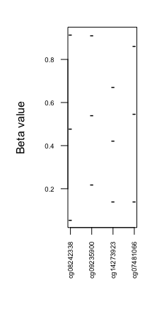

# R package: MethylToSNP
This is the developer version of Bioconductor package [MethylToSNP](http://bioconductor.org/packages/devel/bioc/html/MethylToSNP.html).   


MethylToSNP looks for patterns in Methylation array data and identifies methylation probes with SNP-like patterns. The analysis requires at least 3 samples to run. More than 50 samples is recommended for reliable SNP identification. EPIC, 450k and 27k arrays are supported.

The method allows to remove outliers, which adds robustness to the analysis and is enabled by default. A confidence score is calculated to show how close the observed pattern of methylation beta values is to a canonical case of a SNP in a homozygously methylated CpG locus. Additionally, fine-grained tuning of detection parameters is possible.

If needed, MethylToSNP can overlap the SNPs identified in methylation data with known SNPs from dbSNP, for instance.

The method MethylToSNP has been published in [LaBarre and Goncearenco et al. Epigenetics & Chromatin (2019) 12:79](https://epigeneticsandchromatin.biomedcentral.com/articles/10.1186/s13072-019-0321-6)


## Installation

Install directly from GitHub:

```r
install.packages("devtools")
library(devtools)
install_github("elnitskilab/MethylToSNP")
```

Once it is available in Bioconductor you would be able to install it in R as:

```r
if (!requireNamespace("BiocManager", quietly=TRUE))
    install.packages("BiocManager")
BiocManager::install('MethylToSNP')
```


## A basic example with bundled data (EPIC array)

```{r}
library(minfiDataEPIC)
data(minfiDataEPIC)

> dim(MsetEPIC)
[1] 866836      3


> class(MsetEPIC)
[1] "MethylSet"
attr(,"package")
[1] "minfi"

x <- MethylToSNP(MsetEPIC)
[MethylToSNP] Warning, SNP detection may be unreliable in datasets with less than 50 samples
[MethylToSNP] Optionally, specify SNPs in a data frame with row names corresponding to cg probes (such as SNPs.147CommonSingle in minfiData or minfiDataEPIC package)

x
	   confidence samples_low samples_mid samples_high
cg08242338        0.5           1           1            1
cg09235900        0.5           1           1            1
cg14273923        0.0           1           2            0
cg07481066        0.5           1           1            1

plotPotentialSNPs(x, MsetEPIC)
````


In order to overlap predicted SNPs with known common variants from dbSNP:

```{r}
MethylToSNP(MsetEPIC, SNP=SNPs.147CommonSingle)

[MethylToSNP] Warning, SNP detection may be unreliable in datasets with less than 50 samples
DataFrame with 4 rows and 10 columns
	   confidence samples_low samples_mid samples_high    Probe_rs Probe_maf      CpG_rs   CpG_maf      SBE_rs   SBE_maf
	    <numeric>   <integer>   <integer>    <integer> <character> <numeric> <character> <numeric> <character> <numeric>
cg08242338        0.5           1           1            1          NA        NA          NA        NA          NA        NA
cg09235900        0.5           1           1            1          NA        NA  rs17556373  0.049321          NA        NA
cg14273923          0           1           2            0          NA        NA          NA        NA          NA        NA
cg07481066        0.5           1           1            1          NA        NA          NA        NA          NA        NA
```

## Example reading from a CSV file with beta values (450k array)

```{r}
library(data.table)

m <- as.matrix(
		data.frame(
			fread("beta_values.csv", header=T),
			row.names=1))

dim(m)
[1] 473767     95

library(minfiData)

# consider the first 10000 probes only:

x <- MethylToSNP(m[1:10000,], SNP=SNPs.147CommonSingle, verbose=FALSE)

DataFrame with 21 rows and 10 columns
		confidence samples_low samples_mid samples_high    Probe_rs Probe_maf      CpG_rs   CpG_maf      SBE_rs   SBE_maf
	<numeric>   <integer>   <integer>    <integer> <character> <numeric> <character> <numeric> <character> <numeric>
cg00009523       0.63          13          44           38          NA        NA   rs5024308  0.378395   rs5024308  0.378395
cg00027155       0.86           3          21           71          NA        NA  rs60223258   0.08726  rs60223258   0.08726
cg00051154       0.27          51          36            8          NA        NA   rs6725848  0.208466   rs6725848  0.208466
cg00095677       0.67           7          48           40          NA        NA  rs10153291  0.133693  rs10153291  0.133693
cg00098985          0           0           2           93          NA        NA  rs79197641  0.027556          NA        NA
...               ...         ...         ...          ...         ...       ...         ...       ...         ...       ...
cg00438284       0.86           4          19           72          NA        NA          NA        NA          NA        NA
cg00443543       0.68           4          53           38          NA        NA  rs62090056  0.244808  rs62090056  0.244808
cg00452949          0           0           7           88          NA        NA   rs6769628   0.01218   rs6769628   0.01218
cg00458652          0           0           2           93          NA        NA          NA        NA          NA        NA
cg00474373       0.56          21          42           32          NA        NA   rs9679409  0.417332   rs9679409  0.417332
```


## Example with GEO data

TBD

## Reporting bugs and asking questions

Please create an issue on GitHub.


## Software status

| Resource:     | Bioconductor        | Travis CI     |
| ------------- | ------------------- | ------------- |
| _Platforms:_  | _Multiple_          | _Linux_       |
| R CMD check   | <a href="http://bioconductor.org/checkResults/release/bioc-LATEST/MethylToSNP/"></a> (release)</br><a href="http://bioconductor.org/checkResults/devel/bioc-LATEST/MethylToSNP/"></a> (devel) | <a href="https://travis-ci.org/elnitskilab/MethylToSNP"></a> |
| Test coverage |                     | <a href="https://codecov.io/github/neksa/MethylToSNP?branch=master"></a>   |                  |


[](https://travis-ci.org/elnitskilab/MethylToSNP)
[](https://codecov.io/github/elnitskilab/MethylToSNP?branch=master)
